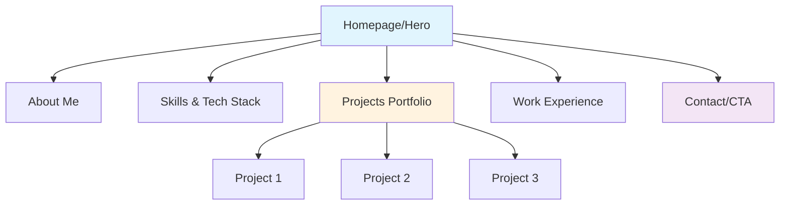
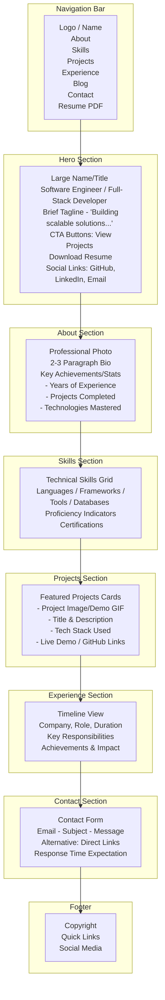
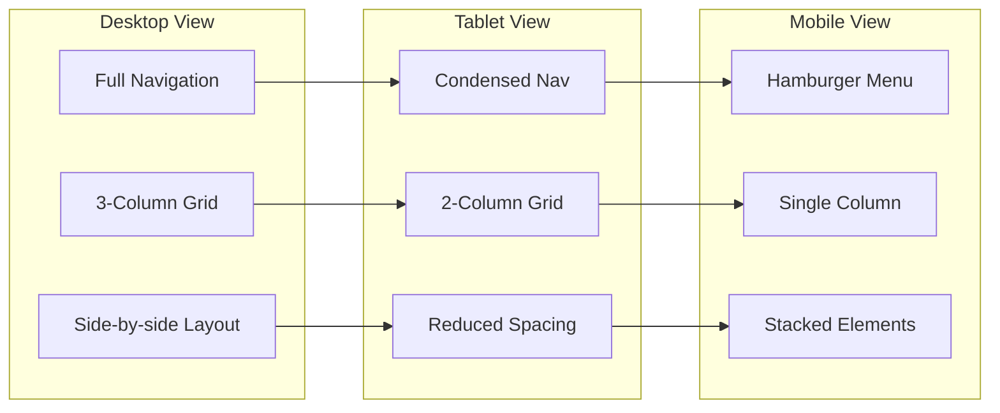

# Personal Portfolio Site Wireframe

## Site Structure Overview

```mermaid
graph TD
    A[Homepage/Hero] --> B[About Me]
    A --> C[Skills & Tech Stack]
    A --> D[Projects Portfolio]
    A --> E[Work Experience]
    A --> F[Contact/CTA]
    
    D --> D1[Project 1]
    D --> D2[Project 2]
    D --> D3[Project 3]
    
    style A fill:#e1f5fe
    style D fill:#fff3e0
    style F fill:#f3e5f5
```

## Detailed Page Layout

```mermaid
graph TB
    subgraph "Navigation Bar"
        NAV[Logo / Name <br/> About <br/> Skills <br/> Projects <br/> Experience <br/> Blog <br/> Contact <br/> Resume PDF]
    end
    
    subgraph "Hero Section"
        HERO[Large Name/Title <br/> Software Engineer / Full-Stack Developer <br/> Brief Tagline - 'Building scalable solutions...' <br/> CTA Buttons: View Projects <br /> Download Resume <br/> Social Links: GitHub, LinkedIn, Email]
    end
    
    subgraph "About Section"
        ABOUT[Professional Photo <br/> 2-3 Paragraph Bio <br/> Key Achievements/Stats <br/> - Years of Experience <br/> - Projects Completed <br/> - Technologies Mastered]
    end
    
    subgraph "Skills Section"
        SKILLS[Technical Skills Grid <br/> Languages / Frameworks / Tools / Databases <br/> Proficiency Indicators <br/> Certifications]
    end
    
    subgraph "Projects Section"
        PROJ[Featured Projects Cards <br/> - Project Image/Demo GIF <br/> - Title & Description <br/> - Tech Stack Used <br/> - Live Demo / GitHub Links]
    end
    
    subgraph "Experience Section"
        EXP[Timeline View <br/> Company, Role, Duration <br/> Key Responsibilities <br/> Achievements & Impact]
    end
    
    subgraph "Contact Section"
        CONTACT[Contact Form <br/> Email - Subject - Message <br/> Alternative: Direct Links <br/> Response Time Expectation]
    end
    
    subgraph "Footer"
        FOOT[Copyright <br/> Quick Links <br/> Social Media]
    end
    
    NAV --> HERO
    HERO --> ABOUT
    ABOUT --> SKILLS
    SKILLS --> PROJ
    PROJ --> EXP
    EXP --> CONTACT
    CONTACT --> FOOT
```

## Mobile Responsive Flow

```mermaid
graph LR
    subgraph "Desktop View"
        D1[Full Navigation]
        D2[3-Column Grid]
        D3[Side-by-side Layout]
    end
    
    subgraph "Tablet View"
        T1[Condensed Nav]
        T2[2-Column Grid]
        T3[Reduced Spacing]
    end
    
    subgraph "Mobile View"
        M1[Hamburger Menu]
        M2[Single Column]
        M3[Stacked Elements]
    end
    
    D1 --> T1 --> M1
    D2 --> T2 --> M2
    D3 --> T3 --> M3
```